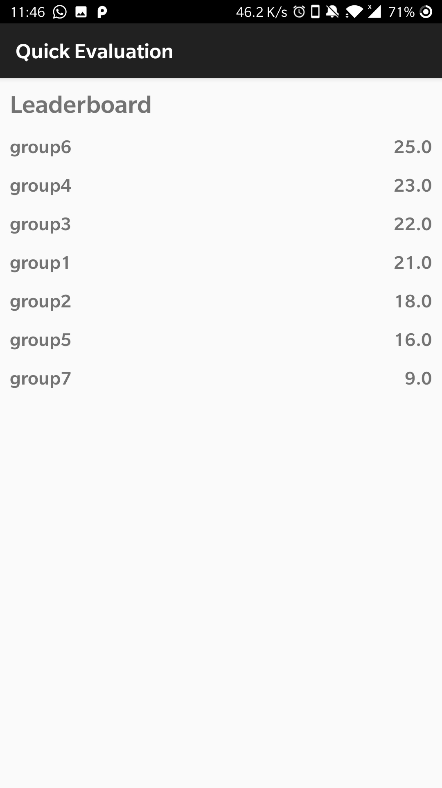

# Quick Evaluation

### **Scenario:**  
A case where students are expected to create a poster and present it during a poster session. During the poster session there are examiners that will be required to visit each group. The application enables examiner to grade the poster based on a simple list of questions.

### **Problem:** 
An approach to pass on the user credentials or authentication information to the app other than giving the username and password to the examiner.

### **Solution:** 
**QR Code** scanning are used for authentication.

## **Technologies:**
* Mobile Framework: Android
* Storage/Database: FireBase
* API: Google Vision API

Application Demonstration Video: [Quick Evaluation](https://youtu.be/EOzKIegDXHs)

## Screenshots

Home Screen             |LeaderBoard Screen             |Login with QR Code scanning Screen            |Group QR code scanning Screen             |
:-------------------------:|:-------------------------:|:-------------------------:|:-------------------------:
  |   |   |  

Question Screen             |Question Screen with submit             |Toast showing already evaluated group after scanning           |
:-------------------------:|:-------------------------:|:-------------------------:
  |   |   

## Getting Started

These instructions will get you a copy of the project up and running on your local machine for development and testing purposes.

### Prerequisites
* Android Studio [Download Android Studio](https://developer.android.com/studio)
* Firebase

### Installing

1. Clone the repository.
2. Open the project in Android Studio.
3. SetUp Firebase and place google-services.json file under app folder.
4. Generate QR code [here](https://www.qr-code-generator.com/) for groups(group id) and examiner(email and password (you can encrypt the data here instead)) 
5. Create these users in Firebase Authentication.
5. Run the application.